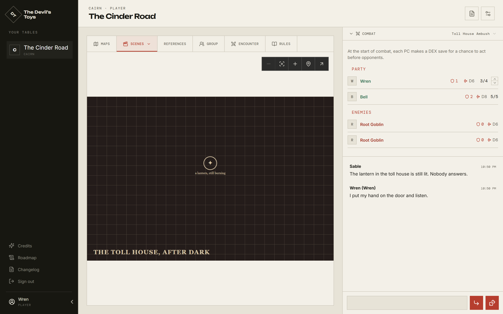

# The Devil's Toys — Player's Guide

This is the guide for people **playing** at a table. It covers what you see, what
you can change, and what stays the GM's.

If you run a table, you want the [GM's Guide](gm/README.md). If you run the
server, the [Admin's Guide](admin/README.md).

The Devil's Toys is a virtual tabletop. It does not come with a game system —
your server's admin installs the ones your group plays — so what is on a
character sheet and what the dice do depend on which system a room runs. One
server holds your group's tables; a table stays where you left it between
sessions.



## Start here

1. **[Joining a table](joining.md)** — your invitation, your password, and
   getting into the room.
2. **[The table](the-table.md)** — the layout: the tab strip, the scene, the
   chat rail, and the phone.
3. **[Your character](your-character.md)** — the sheet, your inventory, and what
   you are holding.
4. **[Building a character](building-a-character.md)** — the book's own creation
   chapter, where your game has one.
5. **[Rolling dice](rolling-dice.md)** — the dice box, private rolls, and
   rolling from the sheet.
6. **[Combat](combat.md)** — the tracker, the board, and your turn.
7. **[The party](the-party.md)** — the Group tab and what the party owns
   together.

## Two things worth knowing early

**Click the tab you are already on.** The tab strip above the scene is also how
you choose _which_ map, scene, reference, or encounter you are looking at.
Clicking the active tab a second time opens that list. Nothing else hints at it.

**Almost everything is shared.** What you type in chat, the dice you roll, the
notes you draw on a map — the whole table sees them as they happen. The
exceptions are called out where they come up: private rolls, and your own
character sheet before you make a character active.

## What is not here yet

All three guides — [player](README.md), [GM](gm/README.md), and
[admin](admin/README.md) — are written. Still to do:

- Using The Devil's Tables, the separate random-table editor. Its own
  [devils-tables.md](../../devils-tables.md) covers this for now.
- Music, the calendar, and map drawing get a paragraph each in
  [The table](the-table.md) and could each carry a page of their own.
- [Building a character](building-a-character.md) is the one page with no
  picture: the screenshot script has no shot of the wizard yet, and a page here
  only carries pictures it can regenerate.

## About the screenshots

Every picture here is generated from a real, throwaway table by
`scripts/docs-screenshots.mjs`, so they cannot drift from the interface by being
forgotten. To redraw them after a change:

```bash
npm run build && node scripts/docs-screenshots.mjs
```

The table in the pictures runs one particular game system. Another will differ in
what is on the character sheet and what the dice do, not in how the room works —
where a difference matters, it is called out.
