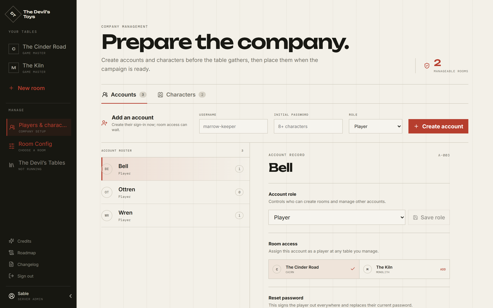

# Accounts

[← Back to the admin guide](README.md)

Everything here lives under **Players & characters**, in the rail's Manage
section. GMs see it too, with a narrower view; what follows is what an admin
sees.

## The roster

An admin's roster is **every account on the server except their own**. A GM's is
much smaller: the player-level accounts they created, plus the players in rooms
they run.

Your own account is never in the list. That is why you cannot reset your own
password or change your own role — see
[First run](first-run.md#make-a-second-admin-today).

## Creating an account

**Add an account** takes a username, an initial password, and a role.

- Usernames are 2–32 characters, and may contain letters, numbers, dots,
  dashes, and underscores.
- Passwords are 8–128 characters. This one is temporary in spirit but not in
  mechanism — nothing forces a change, and the account holder cannot change it
  themselves, so hand it over in a way you are comfortable with.
- **Only an admin may create a game master or another admin.** A GM creating an
  account can only make a player.

Room access is a separate step, in the account's own record. You can create
every account you need before any room exists.

## Invitations, and what they quietly do

The other way in is an invitation link, made by a room's GM from inside the
room. That flow is the player's, and it is documented in
[Joining a table](../joining.md). Two things about it are the admin's business:

**An invitation creates the account immediately.** The moment the link is made,
the account exists with an unguessable placeholder password, and the username is
taken. An invited name you see on the roster with no rooms and no activity is
probably an invitation nobody has redeemed yet.

**Revoking an invitation does not remove the account.** It invalidates the link.
The account stays, holding its username.

Links expire 30 days after they are made, and each one can be redeemed once.
The token is stored hashed, so an admin reading the database cannot recover a
link that has already been handed out — reissue instead.

## Resetting a password

From the account's record. It does two things:

1. Replaces the password.
2. **Signs that account out everywhere**, dropping its sessions and
   disconnecting it from any room it is sitting in.

An admin can reset any account, including another admin's. A GM can reset only a
non-admin account they manage; the application says so plainly rather than
failing quietly.

## Changing a role

**Admins only.** Choose the role on the account's record and save.

Promoting is uneventful. Demoting a game master to a player is not, because a
GM may be the only person who can run their rooms:

> Downgrading this account will transfer their room / rooms to you. Confirm the
> role change to continue.

Confirming does exactly that, for every room they run:

- **you** become the room's GM;
- **they** stay in the room as a player;
- the room's recorded creator becomes you.

The demoted account is signed out so it cannot keep acting on the old role from
a page it already had open.

This is the supported way to hand a table over when someone stops running it. If
you want a _different_ admin to inherit the rooms, have that admin perform the
downgrade — the rooms go to whoever clicks.

## Characters

The **Characters** tab of the same screen prepares character records before a
campaign starts: make the character, then choose its player and its room
independently.

Give the player access to the room _before_ assigning them a character in it.
Full sheets stay where they belong, on the room's own Characters screen.

## What you cannot do

There is no delete-account action. An account that should stop being used is
demoted to player and removed from its rooms; the row stays, and so does its
username.

---

[← Back to the admin guide](README.md) · [Rooms →](rooms.md)
