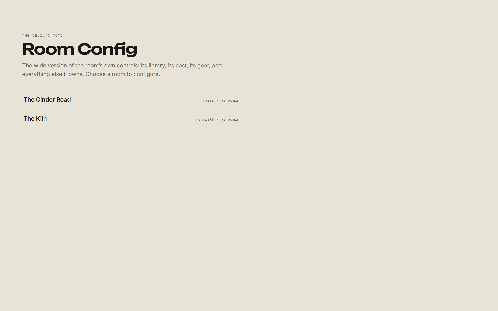

# Rooms

[← Back to the admin guide](README.md)

## The Rooms section

**Management → Rooms** in the rail is the register of every room on the server:
what each one is played on, who runs it, and who sits at it. A GM sees the same
screen holding only the rooms they run.

Three things happen here that happen nowhere else:

- **Opening a room for somebody else.** The create form takes a name, a system,
  and — for an admin — the account that will run it. A GM's form has no such
  field: a GM makes rooms for themselves.
- **Assigning its players.** The room's record lists every account you manage
  with a toggle beside each. It writes the same memberships as **Room access**
  on an account's own record; this is the other way round, and one room at a
  time rather than one account at a time.
- **Handing the room to a different GM**, below.

Deleting a room is here too, and is the same permanent deletion the room's own
settings offers.

## Reaching every room

**Room Config** is where a room is set up rather than run. It opens from the
rail's Manage section, at its own address, carrying the room you already had
open or asking which one.

What each role finds there:

- a **player** reaches nothing;
- a **GM** reaches the rooms they are GM of;
- an **admin** reaches every room on the server, marked _as admin_, **without
  joining any of them**.

Archived rooms are listed too, and marked. Retiring a room is exactly when
somebody wants to go and tidy it up.

## What "without joining" means

This is the part worth being precise about, because it is a privacy promise as
much as a convenience.

Reaching a room as an admin **does not add you to it**. You appear in no room's
presence, you receive none of its chat, and the players see no sign that you are
there. Membership is untouched.

Inside the panel, and inside the room's own routes, you are treated as the
room's GM — a Library an admin cannot list is not a Library they can manage. So
the two facts to hold together are:

> An admin can see and change anything in any room, and is never _at_ the table
> unless they were invited to it.

One consequence worth knowing: **an admin who genuinely plays in a room sees it
as its GM**, in the game as well as in the panel. There is no way to hold an
admin account and sit at a table as an ordinary player.

## Archiving

Archiving is a GM's action, in the room's own settings, not an admin-only one.
An archived room drops out of the main room list into an **Archived** section
and can be restored from the same place.

Archiving changes nothing about the room's contents. It is a way of saying "not
this campaign, for now".

**Prefer archiving to deleting.** It is the reversible one.

## Deleting a room

**Admins only.** It is in the room's settings and on the room's record under
**Management → Rooms**, behind a **Permanent deletion** disclosure in both, and
you must type the room's name to arm the button.

> Delete this room and all of its messages, memberships, and stored room data.
> This cannot be undone.

That is accurate, and broader than it sounds. Deleting a room removes its
uploaded files from disk as well as its rows: every map, scene, reference, and
audio track, plus the portraits belonging to its hirelings and shared assets.

What is _not_ deleted:

- **Accounts.** Members lose the room, not their sign-in.
- **Characters** owned by a player rather than pooled in that room.

There is no undo and no trash. If you are not certain, archive it, and delete it
next month when you still feel the same way.

## Who a room's GM is, and how that changes

A room acquires a GM in three ways:

1. **Whoever created it** becomes its GM.
2. **An admin names one** when they open the room, or hands the room over
   afterwards from **Management → Rooms**.
3. **Whoever demotes its GM to player** inherits it — see
   [Accounts](accounts.md#changing-a-role).

Adding somebody to a room still always adds them as a **player**. The GM chair
is a separate control, on the room's own record, and only an admin sees it.

Handing a table over takes one action:

1. Open **Management → Rooms** and select the room.
2. Choose the incoming GM under **Game master** and assign it.

What that does, and it says so before it does it:

- the account you chose becomes the room's GM;
- the outgoing GM **stays at the table as a player**, rather than being turned
  out of it;
- the room's recorded creator becomes the new GM.

Only a game master or admin account can be seated. A player-level account is not
offered, because demoting an account to player already takes its rooms away —
seating one would be undone the next time anybody looked.

The incoming GM sees the change where they sit: they are not signed out, and
neither is the outgoing one.

An admin is never locked out regardless: Room Config reaches every room whether
or not anyone can run it from the inside.

---

[← Accounts](accounts.md) · [Operating the server →](operating.md)
