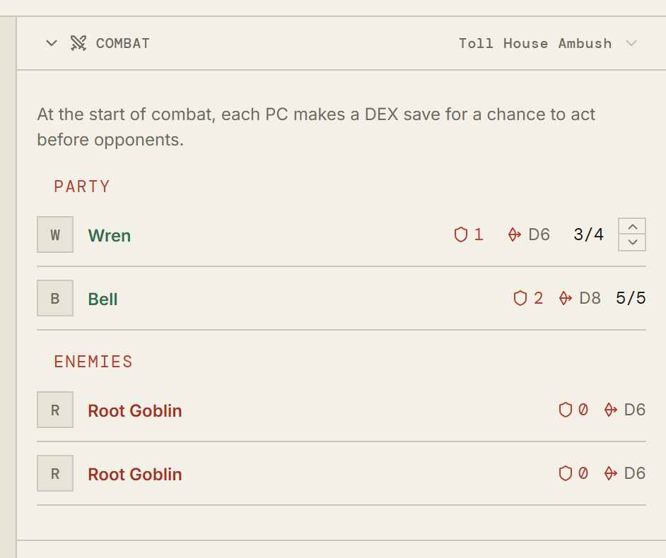

# Combat

[← Back to the guide](README.md)

When the GM starts a fight, a **Combat** panel appears above the chat and a
**Combat** tab appears on a phone's bottom bar. It stays there until the fight
is over.

## The tracker

Everyone in the fight, split into **Party** and **Enemies**, with the fight's
name at the top. If more than one fight is running, the chevron beside the name
switches between them.

Each row carries what is plain to anyone standing in the room:

- the **shield** and a number — armour;
- the **crossed swords** and a die — the weapon that combatant is holding, and
  what it does. A second mark means a second weapon, whether that is a
  character fighting with both hands or a creature with two ways to hurt you;
- **hit points**, as current over maximum, for the party. A creature's are the
  GM's business and are not sent to you at all.

The arrows beside your own character's hit points change them from here, so
taking a hit does not mean opening the sheet mid-fight.

Above the list your system may state how the fight opens — Cairn's DEX save for
the chance to act before your opponents is written there rather than left for
someone to remember.

**Rolling an attack.** Click the weapon mark beside a name to roll its damage
into chat. You can roll for **your own characters** and for the **party's
hirelings**; the GM rolls for creatures. This is a rule about whose turn it is
to pick up the dice, not a lock — the dice box will roll anything you ask it to.

Clicking a name opens what is known about that combatant.

## The board

The **Encounter** tab is where the fight is laid out. Your GM chooses between
two kinds of board, and you may see either.

**Zones** are named places in a row — _the doorway_, _behind the bar_, _up the
stairs_ — with everyone standing in one, or waiting below the row until they are
placed.

**A map** is a picture with tokens on it, positioned rather than sorted into
groups. A map put on the encounter tab is shown to the table whether or not the
Maps tab has revealed it; putting a fight on a map does not give away the map.

Either way, **you move your own characters and the party's hirelings**. Drag the
token, or click to pick it up and click where it should go — the second way is
the one that works on a phone. The GM moves anyone.

## What players cannot do

Adding and removing combatants, changing sides, setting initiative, damaging
creatures, and ending the fight are the GM's. You can change your own
character's hit points and move your own tokens; everything about anyone else's
is theirs.

## Next

[The party →](the-party.md)
