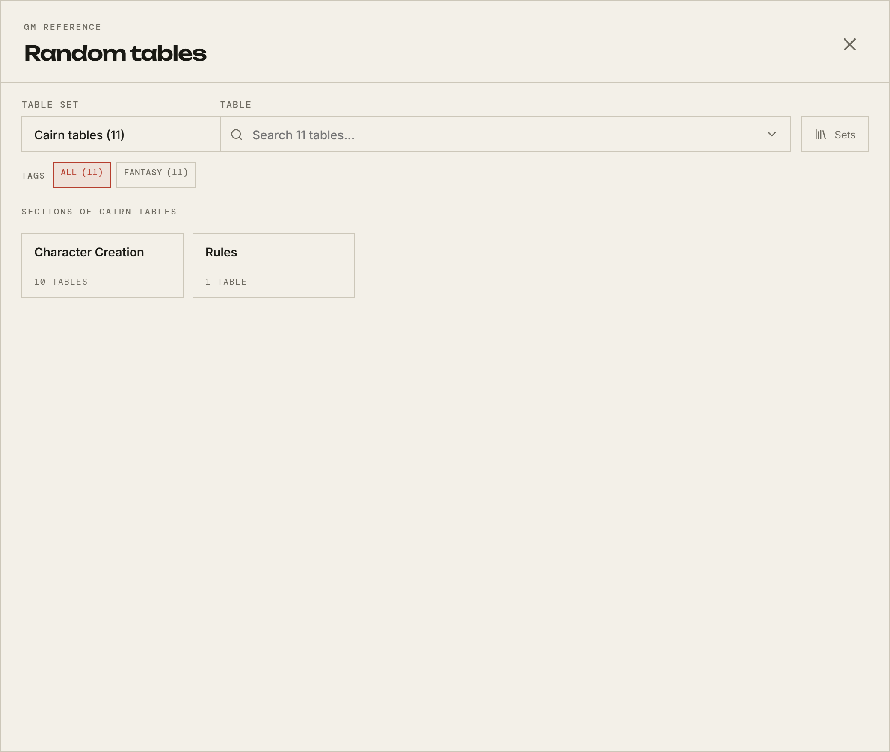

# At the table

[← Back to the GM guide](README.md)

What you drive during a session. All of it lives in the room rather than in Room
Config, because all of it changes what the table sees right now.

## Setting the scene

The **Maps** and **Scenes** tabs show whichever asset the room is currently on.
You change that from **Room Config → Library** with **Make active**, or from the
Library dialog the picture icon in the room header opens.

Remember the two switches:

> **Active** decides which asset the room is on. **Visible** decides whether
> players can see it.

An active map that is not visible is yours alone — which is how you get one
ready without showing your working. Making something active also makes it
visible, so if you want it hidden, hide it afterwards.

Zooming and panning are per-person; nobody else's view moves when yours does.

**Ping Scene** in the toolbar puts a marker on everyone's screen where you
click. If map notation is on, you can also draw, label, and mark up the map
together — everyone can draw and undo, and only you can clear the whole thing.

## Handouts

References are handouts, and players only see the ones you have revealed.
**Reveal** in the Library, and it appears on their References tab immediately.
Revealing mid-session is the normal way to hand something over.

A reference can be a Markdown file rather than an image, which is how you give
the table something to _read_ — a letter, a ledger, a contract — rather than a
picture of a page.

## Rolling behind the screen

The dice box has a third visibility setting you have and your players do not.

|               | What the table sees                                             |
| ------------- | --------------------------------------------------------------- |
| **Standard**  | Everything.                                                     |
| **Private**   | That a roll happened; the result goes to the roller and to you. |
| **Invisible** | Nothing at all.                                                 |

**Invisible** is the roll behind the screen: no message, no marker, no hint that
you rolled. Use it for the things a player should not know are being decided.

Private, by contrast, still tells the table a roll happened — it hides the
number, not the event.

## Random tables

The table icon in the room header. Every table from all three rulebooks, plus
any custom set on this server.

Choose a set, filter by tag, or type ahead to find a table by name. Rolling
gives you the same four visibilities as the dice: public, private, invisible, or
**revealed** — rolled out of sight and then shown to the table once you decide
it should be.

Writing and curating tables happens in **The Devil's Tables**, a separate
application on its own port, linked from the rail. Its own
[guide](../../../devils-tables.md) covers that.

## The clock

With the calendar switched on, the calendar icon in the header shows the room's
date and lets you advance it.

Advancing announces itself in chat, so the table knows time has passed without
you narrating the bookkeeping. How far one click moves depends on the
segments-per-day you set: one advances whole days, and more than one advances a
part of a day at a time.

The month and the year in the calendar's own header are the pickers that move
the page. Browsing is safe — looking does not move the clock — and while you are
reading another month the header shows only that month, with the date time is
actually at printed beneath the grid, so a page you are only visiting never
claims to be today.

An event that runs for several days is on each of them, numbered as it goes. An
event you have hidden is on your calendar and on nobody else's, drawn dashed
with a struck-through eye; the switch is on the event itself, here and in Room
Config, and showing one puts it on the players' calendars as soon as you save.

Building the calendar itself is in [Room Config](room-config.md).

## Music

With music switched on, the note icon opens the shared player.

**Playback is yours.** You choose the track, play, pause, skip, and set repeat
and shuffle; the dock says "GM-controlled playback" on your side. Players get no
transport at all — theirs shows what is playing, a visualiser moving with it,
and their own volume.

If the room has playlists, you also choose which running order it plays through;
it then advances within that order rather than through everything the room owns.
A room with no playlists plays everything it has.

Turning music off in room settings pauses whatever is playing.

## Chat

You can clear the room's chat, which nobody else can. It is worth knowing this
deletes the log — including the dice history everyone has been reading — rather
than hiding it.

## Your own character

Nothing stops you having one. A GM with an active character appears in the party
like anyone else. If you are running the game you probably do not want one, but
the pooled characters you prepare for players are managed from the same
Characters screen.

---

[← Back to the GM guide](README.md)
