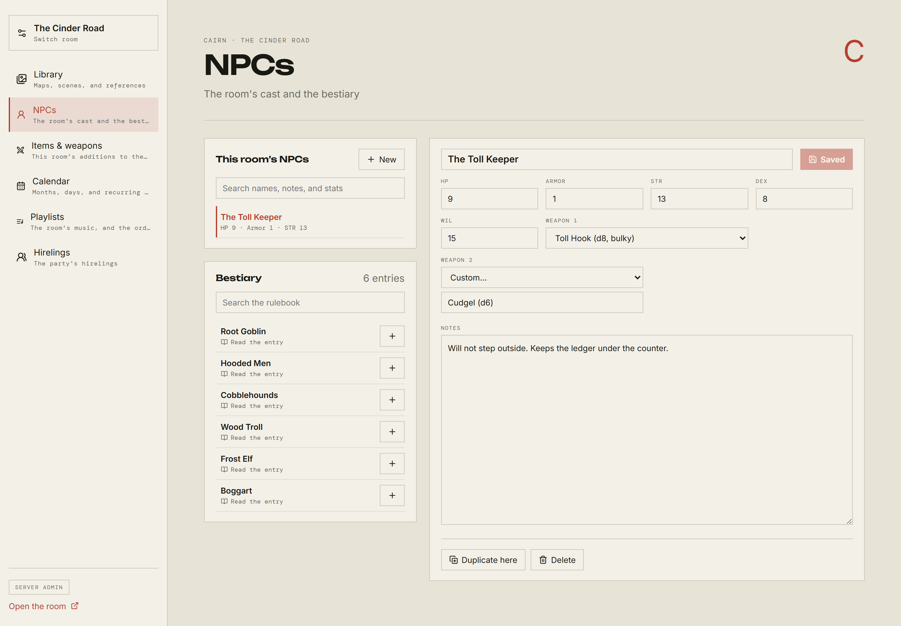
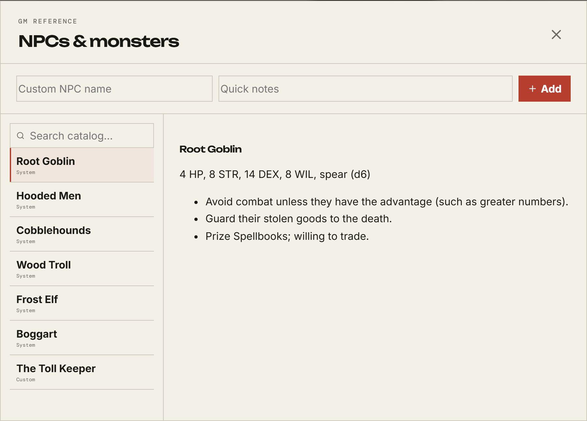
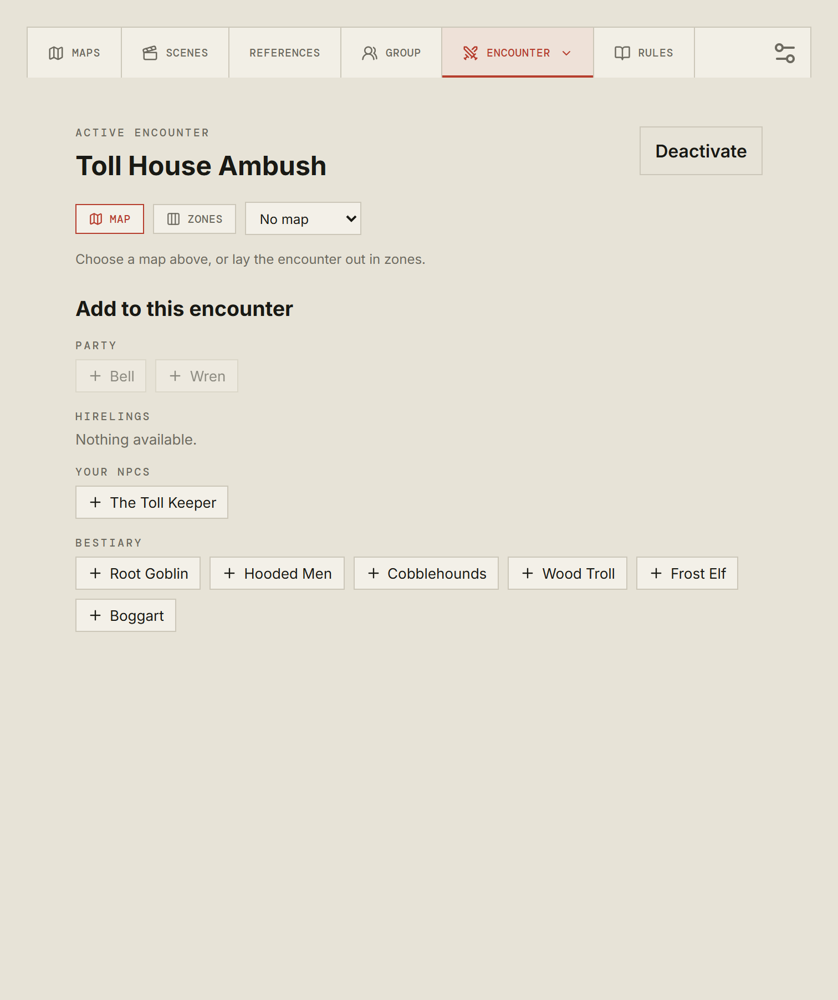

# NPCs and encounters

[← Back to the GM guide](README.md)

## The bestiary and the room's cast

**Room Config → NPCs** puts three things on one screen: the creatures your
rulebook ships with, the ones you have written for this room, and the editor for
either.

The **Bestiary** on the left is your system's own. **Read the entry** shows the
book's text; the **+** copies it into this room as an NPC you can then change
without touching the original.

**This room's NPCs** above it are yours. **New** starts an empty one.

### The statblock

The fields come from the system — Cairn gives you HP, Armor, STR, DEX, WIL, and
two weapons; Cities Without Number gives you its book's whole Atk/Dmg/Shock row.

**Weapon 1** and **Weapon 2** are pickers over the room's weapons, with
**Custom…** first for anything the book never priced. A creature armed from the
picker carries that entry exactly as a character would — its damage, its traits,
its reach — rather than having its line read back off the text. Both slots are
filled independently, so one can be picked and the other typed.

If the pickers are missing entirely, your system has no gear catalogue; see
[Room Config](room-config.md#a-thing-you-will-hit-immediately).

A creature with two weapons shows two marks in the combat tracker, and either
can be rolled.

**Duplicate here** copies an NPC within the room — three guards from one. You
can also copy one into another room you configure, when both run the same
system.

### The bestiary in the room

You do not have to open Room Config to look something up mid-session. The skull
icon in the room header opens the same cast and bestiary as a dialog, with the
book's text for each entry.

### Spawned NPCs

Adding a bestiary entry straight into a fight makes a **spawn**: a private copy
so that damaging one goblin does not damage the other. Spawns are deliberately
kept out of your bestiary list, so repeatedly adding goblins does not fill it
with clutter.

The **Spawned NPCs** button in the room header lists them, grouped by the
encounter they belong to, and lets you clear them out when the fight is over.

## Running a fight

The **Encounter** tab in the room.

**Create encounter** with a name. You can have several; the tab's picker
switches between them, and so does the tracker's.

**Activate** is what makes it real for your players: an active encounter puts
the combat tracker in everyone's rail and a Combat tab on their phones.
**Deactivate** puts it away without deleting it.

### The board

Choose **Map** or **Zones**.

**Zones** are named places in a row — _the doorway_, _behind the bar_, _up the
stairs_. Combatants stand in one or wait below the row. Good for theatre of the
mind with just enough structure to answer "who can reach whom".

**Map** puts a picture up with tokens on it. Choose it from the room's maps in
the drop-down beside the toggle. A map shown here is shown to the table whether
or not the Library has revealed it — putting a fight on a map does not give the
map away.

Either board: you move anyone, by dragging or by picking a token up and clicking
where it goes. Players move their own characters and the party's hirelings.

### Filling it

**Add to this encounter** lists what you can bring in, in four groups: **Party**,
**Hirelings**, **Your NPCs**, and **Bestiary**.

A character or hireling already in the fight is marked and cannot be added
twice. Creatures deliberately can be: clicking Root Goblin three times gives you
three goblins with three separate pools of hit points.

### During the fight

The tracker in the rail is where the fight is actually run:

- **hit points** — yours to change for creatures; players can change their own.
  A creature's hit points are never sent to players at all.
- **armour and weapons** — shown to everyone, because what a thing is wearing
  and swinging is plain to anyone in the room with it.
- **attack rolls** — click the weapon mark. You roll for creatures; players roll
  for their own characters and for hirelings.
- **initiative and sides** — yours. Your system decides how that works: Cairn
  and Monolith fix the side order, while Cities Without Number rolls for it and
  offers a per-combatant variant. Where a system rolls, there is a button to
  roll it. Any opening save the rules call for — Cairn's DEX save for the chance
  to act first — is written above the list rather than left for someone to
  remember.
- **conditions** — yours, and only you see them.

## Next

[At the table →](at-the-table.md)
