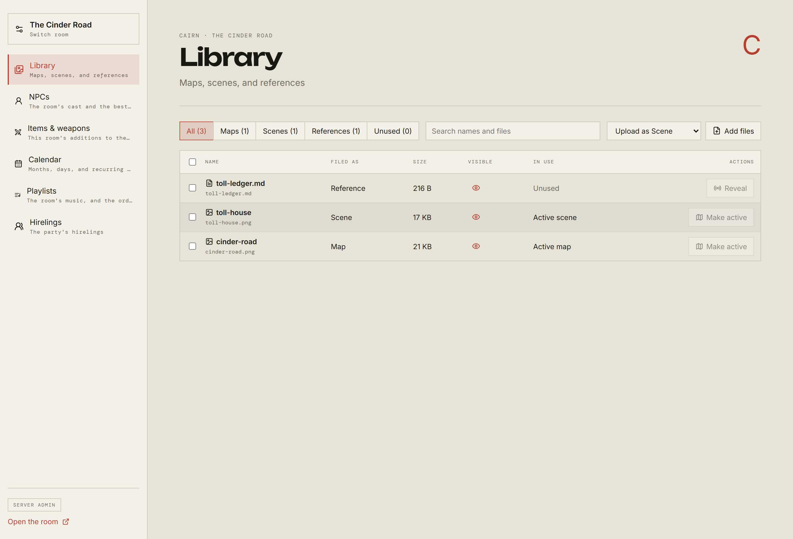
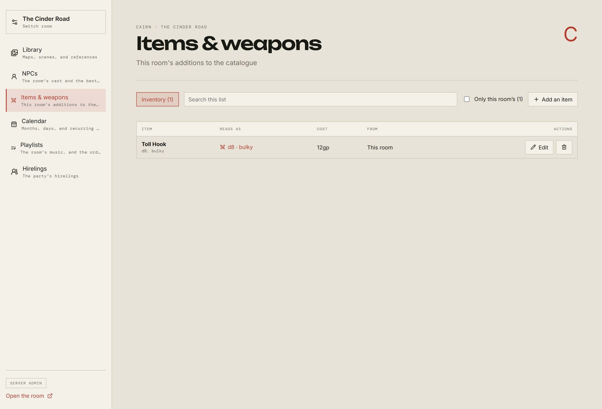
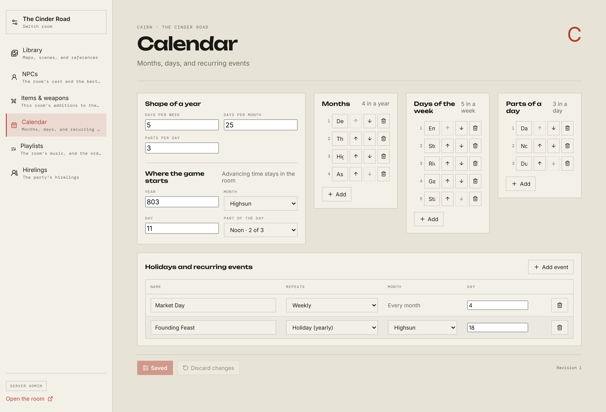
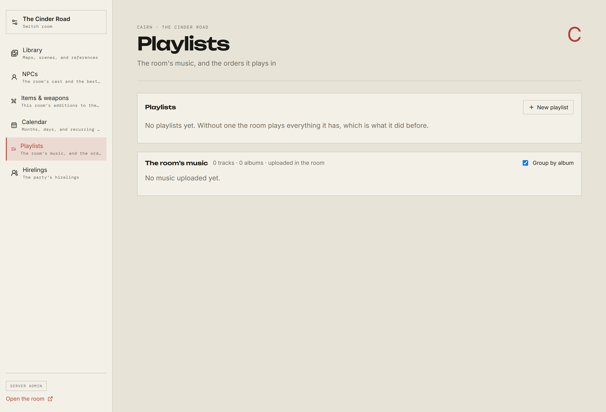
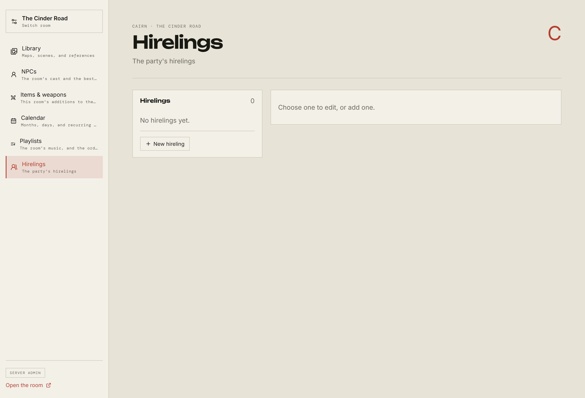

# Room Config

[← Back to the GM guide](README.md)

**Room Config** in the rail's Manage section. It opens in its own tab, on its
own address, carrying the room you already had open or asking which one.

It is the wide version of the room's own controls, and it is where a room is set
up rather than run. Nothing in it replaces anything in the room — the two are
additive.

## The sections a room has

The list down the left follows the room's system and its settings, so no two
rooms necessarily offer the same thing.

| Section                         | Always there?                               |
| ------------------------------- | ------------------------------------------- |
| **Library**                     | Yes                                         |
| **NPCs**                        | Yes                                         |
| **Items & weapons**             | Yes                                         |
| **Calendar**                    | Only once the room's Calendar setting is on |
| **Playlists**                   | Only once the room's Music setting is on    |
| **Hirelings** / **Freelancers** | Only where the system has them              |
| **Starship** / **Group assets** | Only where the system has them              |
| **Campaign**                    | Yes                                         |

A section your **system** does not have is left out entirely, because there is
nothing you could do to gain it. A section your **room** has switched off is
listed and marked, with the switch that turns it on — that is where you would go
looking for it.

## Library

Every map, scene, and reference the room owns.

Upload with **Add files**, having chosen what to file them as. Maps and scenes
take PNG, JPEG, or WebP; references take those **and Markdown**, which is how
you get a written handout rather than a picture of one.

The columns are worth reading properly:

- **Filed as** — Map, Scene, or Reference. Change it by selecting rows and using
  the bulk bar. A Markdown file can only ever be a Reference.
- **Visible** — an eye you can click. Open means the room can see it; closed
  means it cannot. This is the single switch that decides whether a player sees
  a handout, or sees the active map at all.
- **In use** — whether this is the room's current map or scene.
- **Make active** / **Reveal** — the action that puts it in front of the table.
- **Tags** — only in a room whose system offers tags and has them switched on.
  Type your own words on any asset and the search box finds by them, which is
  how a library of two hundred handouts stays usable.

Selecting rows with the checkboxes gives you a bulk bar for refiling, showing,
hiding, and deleting several at once.

**Unused** filters to assets nothing is pointing at: a reference the room has
never revealed, or an image filed as a map or scene that has never been the
active one. It is the tidy-up view.

Two things to hold apart, because they catch people out:

> **Active** is which map the room is on. **Visible** is whether players can see
> it. A map can be active and hidden, which is exactly what you want while you
> are getting one ready.

An encounter map is a third thing again — putting a map on the encounter board
shows it to the table whether or not the Library has revealed it, and reveals
nothing elsewhere.

## Items & weapons

Your room's own additions to its system's gear.

The system's catalogue lives in the application and is never written to. What
you do here is an overlay on top of it: entries you add, entries you retire, and
entries you customise by copying and retiring the original in one step.

- **Add an item** takes a name, the parenthetical, a cost, and a description.
  The panel shows you **how it will be read** before you save — whether it
  counts as a weapon, and what damage, traits, and reach it will carry.
- **Retiring** an entry only takes it out of the pickers. Slots hold plain text,
  so gear already written on a sheet stays exactly where it is.
- Nothing you do here touches any other room.

### A thing you will hit immediately

**Only Monolith ships with a gear catalogue.** Cairn and Cities Without Number
have empty ones, so in those rooms the weapon pickers — on character slots and
on NPC statblocks — have nothing to offer until _you_ add something here.

That is not a fault, and nothing is broken. It means that in a Cairn room, gear
is free text by default, and this section is how you build a catalogue if you
want one. Add a weapon here and it appears in every picker in the room.

## Calendar

Builds the calendar the room's clock then runs.

Months, weekdays, and parts of a day are named rows you can rename, reorder, add
to, and remove — not one comma-separated line. Holidays and recurring events are
a table below, each either weekly or a yearly holiday on a given month and day.

**Parts per day** is what decides how far one click of the clock moves: set it
to one and advancing moves a whole day; set it to three and each click moves
dawn to noon to dusk.

Where the numbers and the name lists disagree — five days a week but four names
— it says so and still saves, because a calendar with an unnamed weekday is
workable.

Advancing the clock is not here. That is a live act, and it stays in the room.

## Playlists

Named, ordered lists of the room's music, beside the room's music itself.

**Add MP3s** puts music in the room without leaving the panel — one file or a
selection — and the tags are read as each one arrives. A file the server refuses
is named and the rest of the selection still lands.

A playlist is a view over the library rather than a gate on it: a track in no
playlist is still in the room and still playable. The room's music is grouped by
album in track order, and this is also where you fix what the tag reader got
wrong — artist, title, album, and track number.

Building a running order takes drag-and-drop, or the arrows beside each track,
and you can add everything at once or an album at a time.

Choosing which playlist is playing stays in the room, with the rest of the
transport.

## Hirelings, and what the party owns

The party's hired help and its shared property — a ship, a debt — depending on
what the system has.

Each is a roster with a sheet, a picture, and an order: create, duplicate,
reorder, delete. Hirelings can be rolled up from the system's own creation
rules rather than filled in by hand.

**These are yours alone.** Players can read them on the Group tab and cannot
change them.

## NPCs

Covered in [NPCs and encounters](npcs-and-encounters.md).

## What your system offers

The bottom of the rail lists the optional rules your system has, if it has any:
the parts of the game the book offers rather than imposes. They are the same
switches the room's own settings carry, and they are here because setting a room
up is when you decide them.

They change this panel as well as the room. Switch **Tags** on and the Library
gains a Tags column and every NPC gains a tag field; switch it off and both go
away again, with the words kept for if you change your mind.

## Working with someone else

A save carries the revision it was built from. If somebody else saved first, the
panel tells you what changed and offers you the choice, rather than silently
overwriting them or failing with an error and losing what you typed.

## Campaign

Importing a whole room’s worth of prepared material — maps, scenes, handouts,
music, a cast, prepared fights, gear, the calendar — from one zip, and exporting
this room as one. It writes to every other section on this list, which is why it
sits at the bottom of it.

Nothing lands until you have seen what it would do: the upload is read first and
summarised, and you confirm or walk away. Importing the same campaign again later
brings across what its author has corrected and leaves what you have changed
since exactly as you left it.

It has [a page of its own](campaigns.md), including how to build one.

## Next

[NPCs and encounters →](npcs-and-encounters.md)
