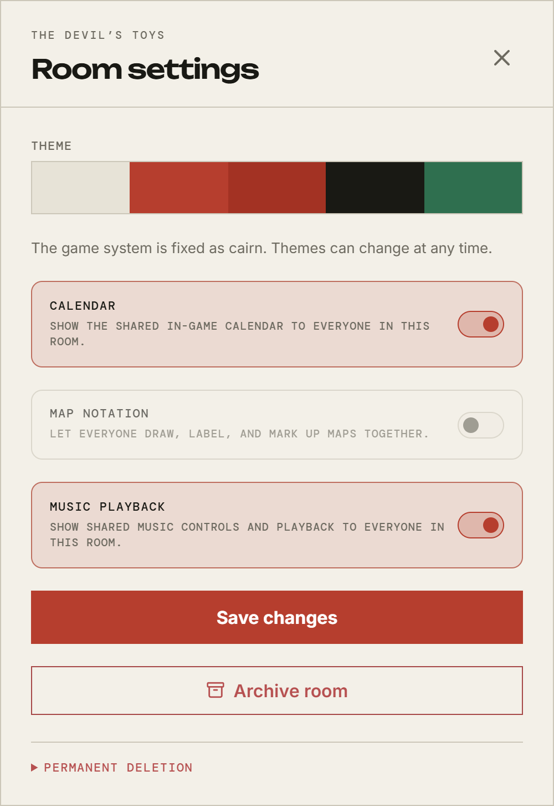
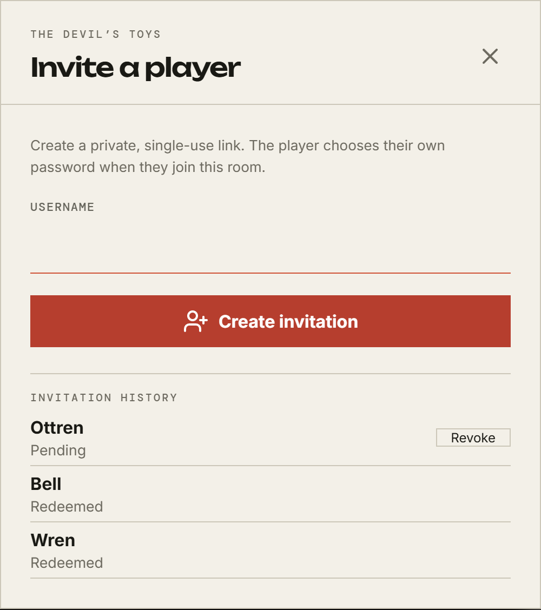

# Your room

[← Back to the GM guide](README.md)

## Making one

**New room** in the left rail, or **Open a room** under **Players & characters →
Rooms**. Either way you give it a name and a system, and you become its GM. The
Rooms tab also lists the rooms you run with their players, so it is the place to
assign a table rather than one player at a time.

**The system cannot be changed afterwards.** It decides the character sheet, the
dice, the rulebook, the bestiary, and which sections Room Config offers you.
Choosing it is the one irreversible decision in making a room; everything else
can be turned on and off later.

The theme starts at the system's default and can be changed whenever you like.

## Settings

The sliders icon at the top right of the room.

**Theme** sets the room's look for everyone. A player who dislikes it can
override the theme for themselves without affecting anybody else, so you are
setting the default rather than dictating.

Three features are off until you turn them on:

|                    | What turning it on does                                               |
| ------------------ | --------------------------------------------------------------------- |
| **Calendar**       | Gives the room a shared in-game date, and you the ability to move it. |
| **Map notation**   | Lets everyone draw, label, and mark up maps together.                 |
| **Music playback** | Shows shared music controls to the room.                              |

Each one also adds its section to Room Config, so a feature you have switched
off is still listed there with the switch that turns it on — that is where
people go looking for it.

Turning music off pauses whatever is playing rather than leaving it running
silently.

## What your system offers

Below those switches you may find more, under the name of the game you are
playing. These are **optional rules**: parts the book offers rather than
imposes, which your system declares and your table decides on. What is listed
depends entirely on the system — a game that offers none shows none, and a game
that _requires_ one says so in a line of text rather than offering a switch you
could not have moved anyway.

**Tags** is the one to know about today, and Monolith offers it. Switch it on
and everything the room keeps a record of can carry words of your own: your
characters, the cast, the party's hirelings, and everything in the Library. They
are your words rather than a list anybody publishes — `inner ring`, `arc two`,
`owes the crew money` — and the boxes you already search in the cast and the
Library search them too, so tagging is how you find something again three months
later.

The same switches are on the Room Config rail, since setting a room up is when
you decide these.

Switching a rule off hides what it added; it does not throw anything away.
Switch tags off and the words stop being shown, and switch them back on and they
are all still there.

## Archiving

**Archive room**, at the bottom of the same panel. An archived room drops out of
the main list into an **Archived** section, and **Restore room** brings it back
from the same place. Nothing is deleted and nothing is lost.

Archive a campaign that has finished. It stays configurable — retiring a room is
exactly when you want to go and tidy it up — and it stays restorable.

Permanent deletion is below that, but only an admin sees it.

## Getting players in

The person icon at the top right opens invitations.

Type a username and **Create invitation**. You get a single-use link; the player
opens it and chooses their own password. You never handle their password, and
they never need an account beforehand.

Things worth knowing:

- **The account exists from the moment you make the link.** The username is
  taken immediately, whether or not anyone redeems it.
- **Links expire after 30 days** and can only be used once.
- **Invitation history** below the form shows every link as _Pending_ or
  _Redeemed_, and lets you **Revoke** one that has not been used. Revoking kills
  the link, not the account.
- **The link is a key.** Whoever opens it first becomes that player at your
  table. Send it the way you would send a password.

If a player already has an account on the server — because they play at another
table — you do not invite them again. Ask an admin to add them, or add them
yourself from **Players & characters** if they are a player-level account you
manage.

## Characters

Players make their own, in the room. You can also prepare characters ahead of
time from **Players & characters** in the rail, and assign them to a player and
a room independently — useful for a one-shot with pre-generated characters.

Give a player access to the room before assigning them a character in it.

You can see and edit every character in your room; players can only edit their
own.

## Next

[Room Config →](room-config.md)
