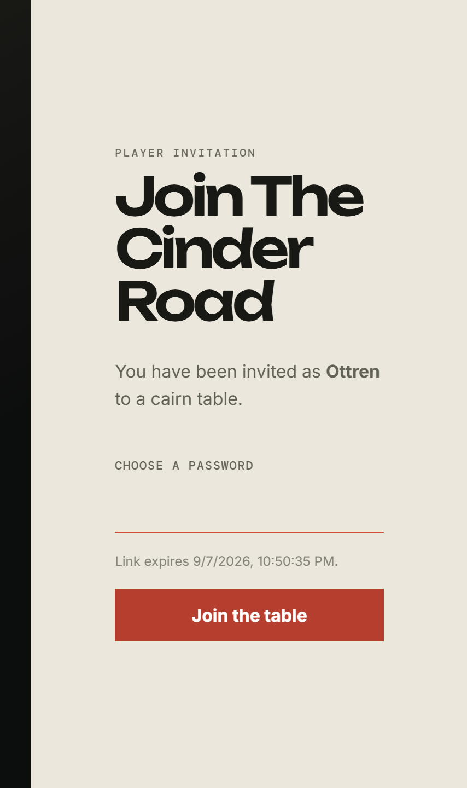
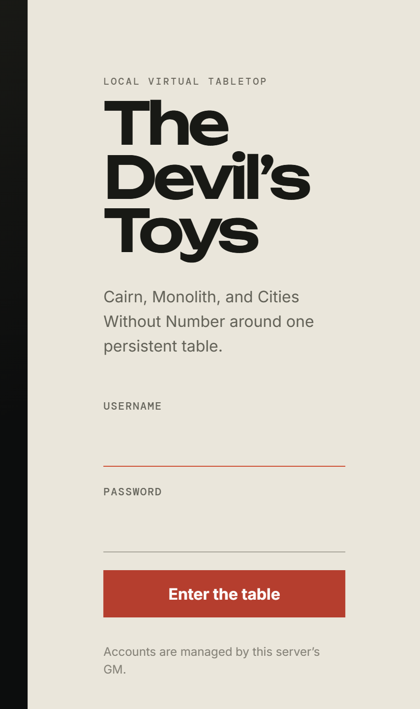

# Joining a table

[← Back to the guide](README.md)

You do not sign yourself up. Accounts on a Devil's Toys server are made by the
people who run it, and you arrive either with an invitation link or with a
username someone has already made for you.

## With an invitation link

Your GM sends you a link that looks like `https://your-server/invite/<a long
token>`. Opening it shows you which table you are joining and the name you are
joining under.

You choose a password. That is the whole of it — the username was decided when
the invitation was made, and the link says who you are before you commit to
anything.

Two things to know:

- **The link expires**, and the screen tells you when. If it has run out, ask
  your GM for another; they can issue a fresh one.
- **The link is single-use and it is a key.** Anyone who opens it first becomes
  you at that table. Treat it like a password until you have redeemed it.

Once you set a password you are signed in and already a member of the table.

## Signing in afterwards

Every visit after that is the ordinary front door.

If you have forgotten your password, there is no self-service reset. Ask
whoever runs the server; an admin can sort you out.

## Choosing your table

After signing in you land on your list of tables. A table you belong to appears
in the left rail and as a card in the middle of the page. Either way in works —
on a phone the rail is folded away, so use the card.

Your role at each table is shown next to your name at the bottom of the rail:
**player** at a table you were invited to, **game master** at one you run.

## Next

[The table →](the-table.md)
