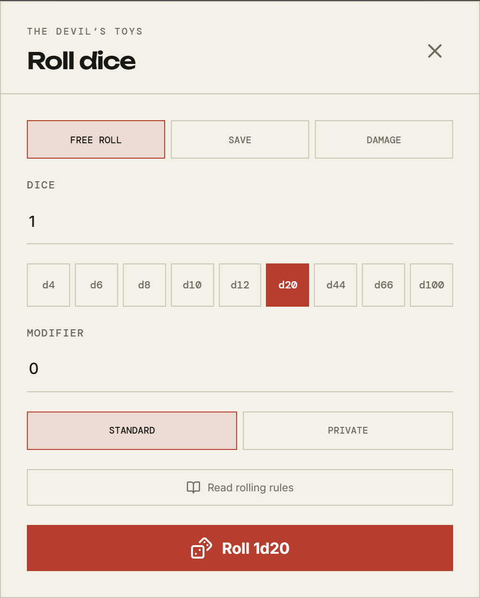

# Rolling dice

[← Back to the guide](README.md)

Three ways to roll, all landing in the same place: the table's chat, where the
history reads in order beside what everyone was saying at the time.

## The quick way: type it

In the chat box:

```
/r d20
```

`/roll` works the same. The expression is the ordinary kind — `/r 2d6+1`,
`/r 3d8`. This is the fastest route when you know what you want.

## The dice box

The dice button beside the send arrow, or **Dice** on a phone's bottom bar.



Across the top, what _kind_ of roll this is. The names come from your system —
Cairn offers **Free roll**, **Save**, and **Damage** — and choosing one sets the
box up the way that system's rules describe, rather than leaving you to
translate them into dice.

Then the dice themselves: how many, which die, and a modifier. **Roll 1d20** at
the bottom says exactly what is about to happen before it happens.

**Read rolling rules** opens the rulebook at the part that governs the roll you
are setting up.

## From your sheet

The dice icon beside an attribute on your character sheet opens this same box,
already pointed at that attribute with its target filled in. See
[Your character](your-character.md).

## From the combat tracker

While a fight is running, your weapon's damage can be rolled from beside your
name in the tracker. See [Combat](combat.md).

## Who sees the roll

Two choices at the bottom of the box:

|              | What the table sees                                           |
| ------------ | ------------------------------------------------------------- |
| **Standard** | Everything: that you rolled, what you rolled, and the result. |
| **Private**  | That a roll happened. The result goes to you and the GM only. |

Private is for the roll whose _outcome_ is yours to know but whose _existence_
is not a secret — you looked for a trap, and whether you found one is not for
the table to read off a number.

There is a third setting, **invisible**, which tells the table nothing at all.
That one is the GM's; it is how they roll behind the screen.

Which one you picked is marked on the message, so nobody has to wonder later
whether a result was the whole story.

## Next

[Combat →](combat.md)
