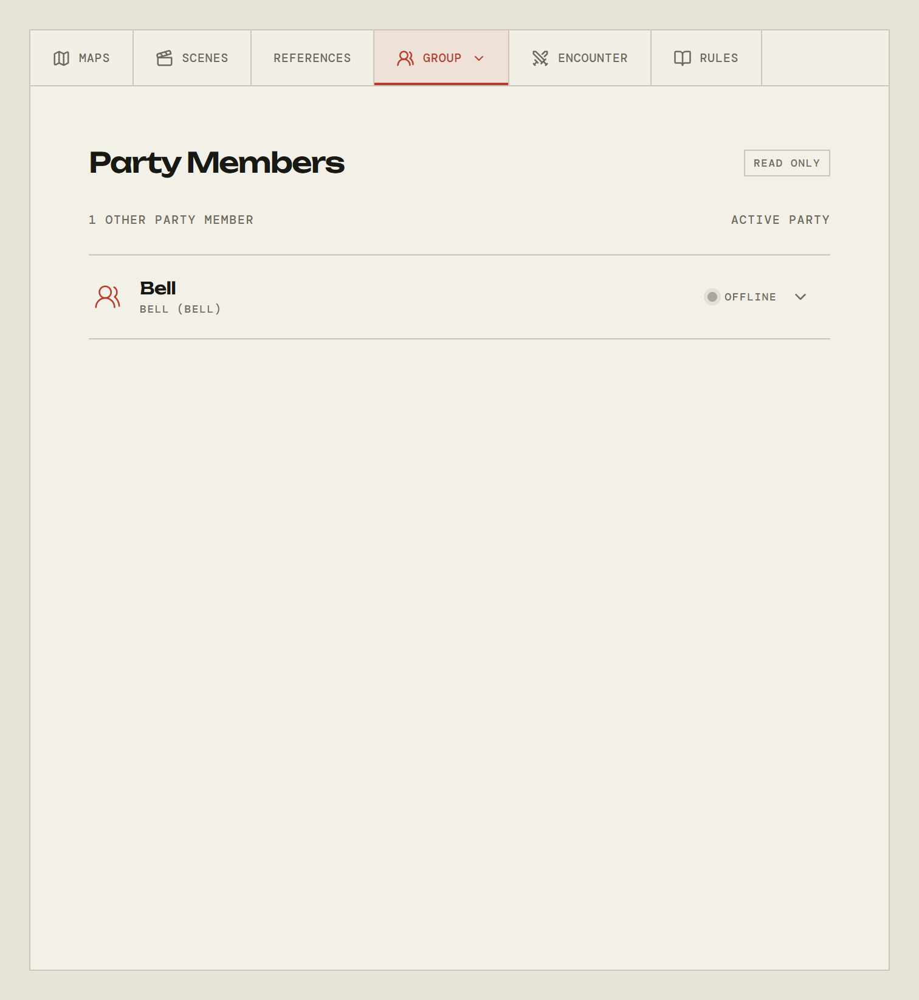

# The party

[← Back to the guide](README.md)

The **Group** tab is the party as a whole: who is at the table, and whatever
your system says a party owns together.

Like the other tabs, clicking **Group** while you are already on it opens a list
of its views. Which views exist depends on the system:

| System                       | Views                                                                   |
| ---------------------------- | ----------------------------------------------------------------------- |
| Cairn, Cities Without Number | **Party Members**, **Hirelings**                                        |
| Monolith                     | **Party Members**, **Freelancers**, **Group Obligations**, **Starship** |

## Party Members

Everyone else at the table, with the character they are currently playing and
whether they are online right now. You are not in the list — it counts "other"
party members, since you are the one reading it.

Expanding a row shows that character's sheet as the table sees it. It is a read
-only view: another player's sheet is theirs to change.

## Hirelings, freelancers, and the rest

The people and property the party holds in common — the porter you took on, the
ship you all share, the debt you all owe.

These are **read only for players**. The panel says so plainly in the corner.
Your GM keeps them, and what they change appears for everyone as they do it. A
Monolith crew's starship works the same way: you can read the sheet, the hull,
and what is installed in the holds, but the GM writes it.

If your character carries something, that belongs on
[your own sheet](your-character.md), not here.

## Rolling from here

Where a shared sheet has something rollable on it, rolling it reports into the
table's chat like any other roll, so the log still holds the whole session in
order.

---

[← Back to the guide](README.md)
