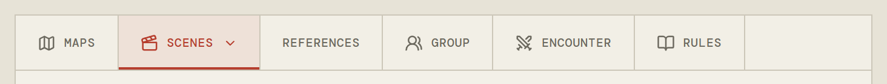
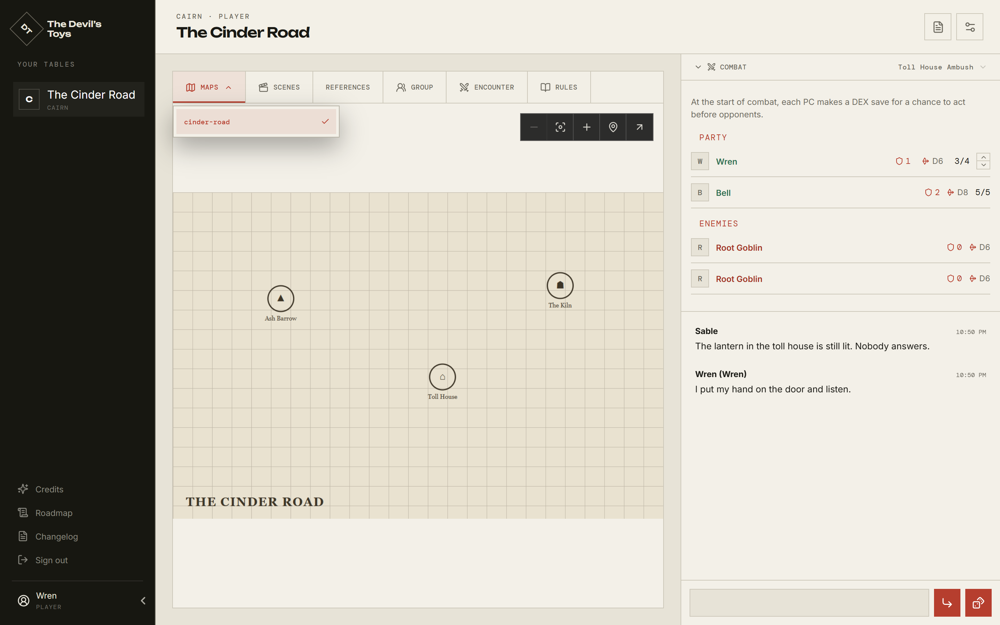
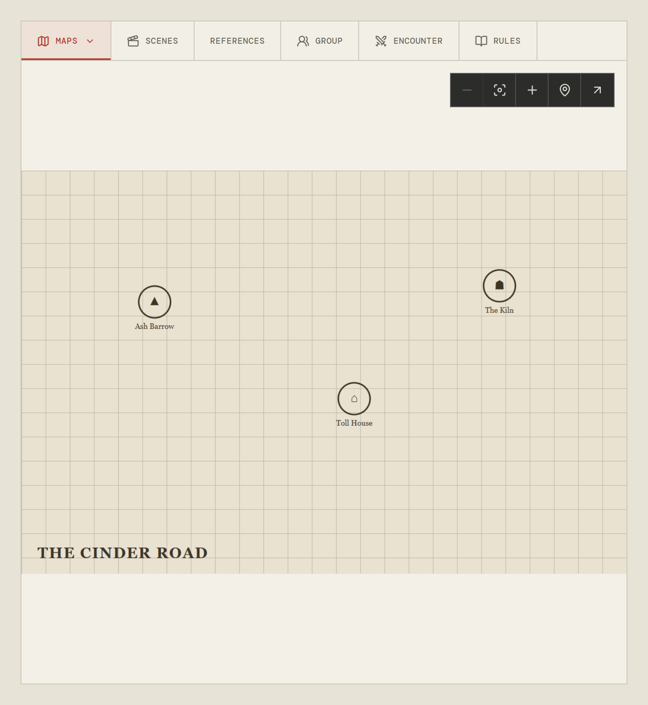
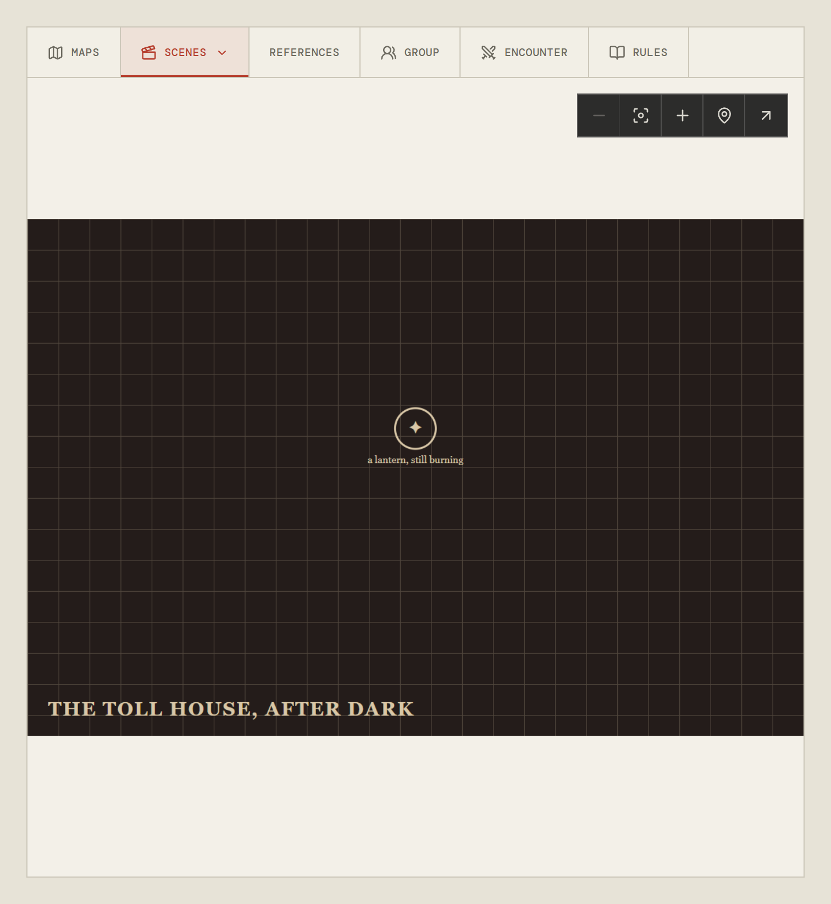
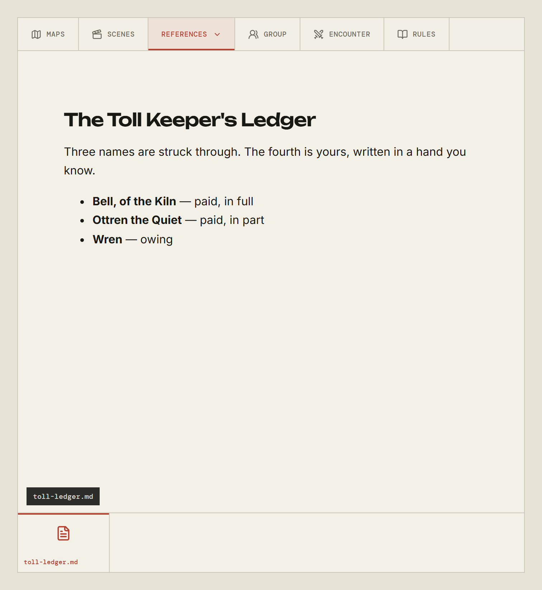
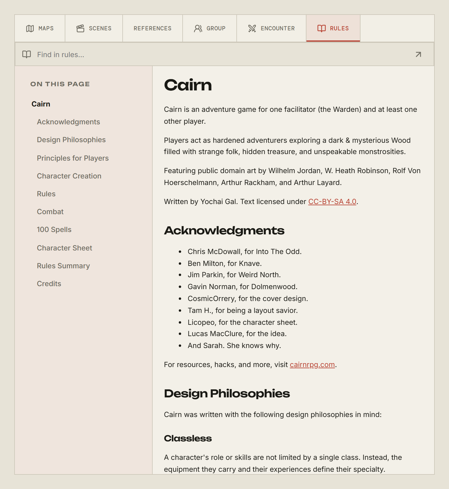
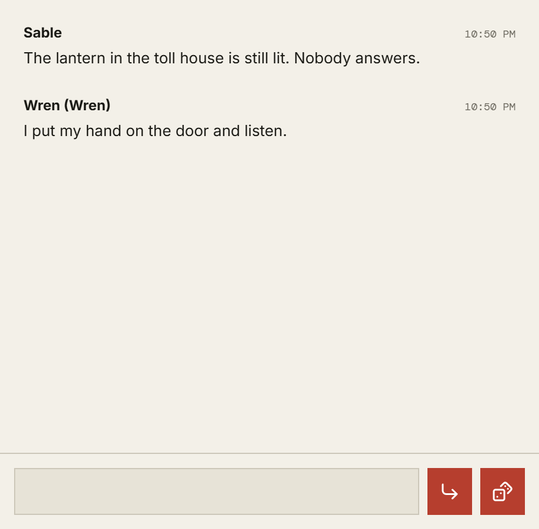
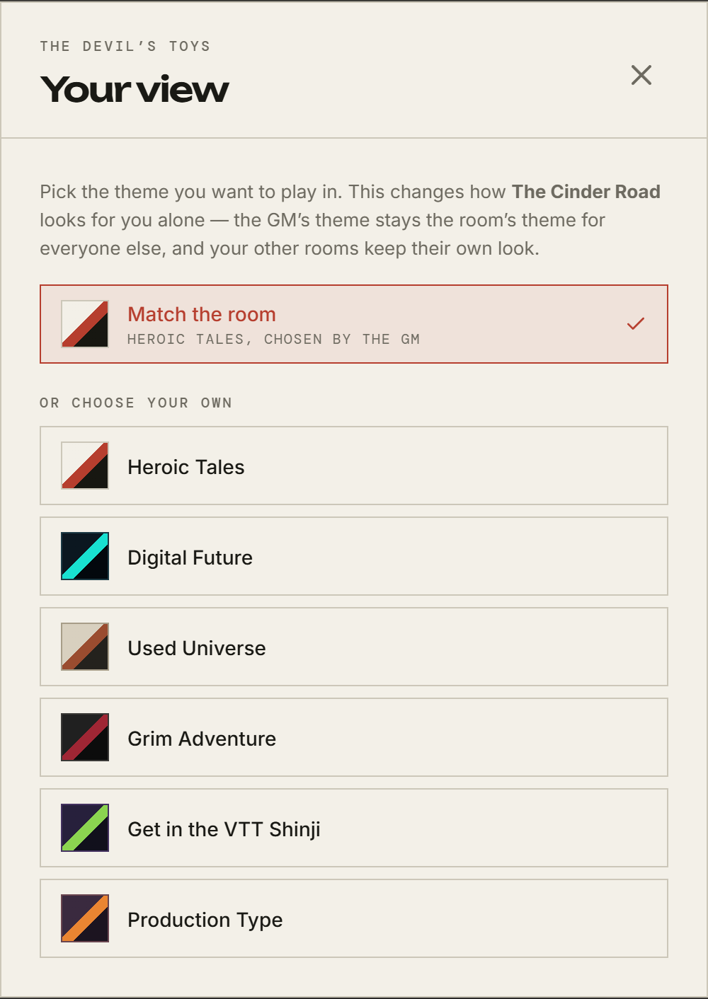
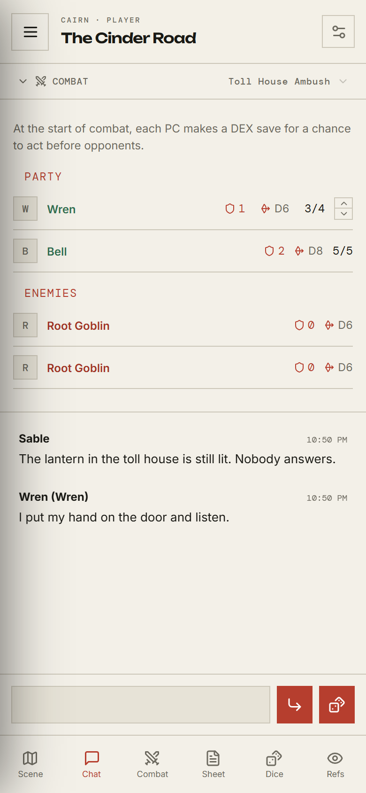
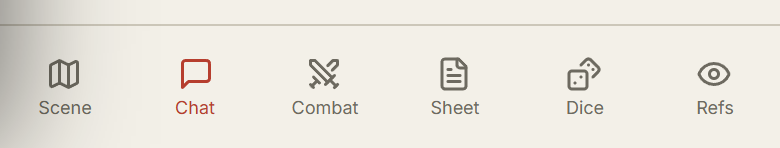

# The table

[← Back to the guide](README.md)

A room is one screen. The big panel on the left is whatever the table is looking
at; the rail on the right is combat and chat; the strip along the top switches
between them.

Opening a table folds the navigation rail — your list of tables, down the left
of every other screen — away, so the room gets the width. The chevron in the
bottom-left corner brings it back, and each table remembers where you last left
it.

## The tab strip

Six tabs. **Group** is missing where the system has no party page, and
**Encounter** only appears once there is a fight to look at:

| Tab            | What it is                                                              |
| -------------- | ----------------------------------------------------------------------- |
| **Maps**       | The map the GM has made current — the overland view, the dungeon floor. |
| **Scenes**     | The picture of where you are now.                                       |
| **References** | Handouts: a letter, a portrait, a page from a ledger.                   |
| **Group**      | The party: who is here, and what you own together.                      |
| **Encounter**  | The board a fight is played out on.                                     |
| **Rules**      | The rulebook for your system, searchable.                               |

**Clicking the tab you are already on opens a list.** That is how you look at a
map other than the current one, re-read an earlier handout, or switch between
two encounters. The small chevron on the active tab is the only hint.

Looking at an older map changes nothing for anybody else. What the _table_ is
looking at is the GM's to set; this only moves your own eyes.

## Maps and scenes

A **map** is the ground you are crossing; a **scene** is what the moment looks
like. They behave identically and are separate tabs so that changing one does
not disturb the other — your GM can put you somewhere new without losing your
place on the map.

The toolbar over the image has **Zoom out**, **Fit Scene**, **Zoom in**, **Ping
Scene**, and **Open in a new tab**. Zooming and panning are yours alone.

**Ping Scene** is not. Click it, then click the picture, and a marker blooms
where you clicked on _everyone's_ screen. It is for "there, that door" without
saying a word.

If your GM has switched on map notation, you can also draw on the map — lines,
shapes, and labels, shared with the table as you draw them. Everyone can draw,
erase, and undo their own marks; only the GM can clear the whole map.

## References

References are handouts, and you only see the ones your GM has revealed. They
can be images or written pages. A new one appearing mid-session is normal — that
is the GM handing you something.

## Rules

Your system's rulebook, in the room, with a heading index down the side and a
search. You are reading the same text the game is built on, not a summary of it.

Some parts of the book are the GM's. Sections marked as such are not sent to
players at all, so this is safe to browse — you cannot spoil a secret by
scrolling.

## Chat and rolls

The rail under the tracker is the table's talk and its dice log together. Rolls
appear as messages, so the history reads in order.

- **Enter** sends. **Shift+Enter** starts a new line.
- **`/r d20`** rolls without opening anything. `/roll` works too, and the
  expression is the ordinary sort: `/r 2d6+1`.
- The dice button beside the send button opens the dice box, which is covered
  in [Rolling dice](rolling-dice.md).

## The room header

Top right, next to the room's name:

- **Manage characters** — your sheet. See [Your character](your-character.md).
- **Shared audio** — appears when your GM has music on and has uploaded
  something. Playback is theirs to drive; your control is the volume in your own
  ears. The dock names the track and moves with it, so there is nothing to work
  but the volume — except where your browser has refused to start the sound on
  its own, when it offers **Tap to listen**.
- **Calendar** — appears when the table keeps one. It shows the date, and the
  GM moving time forward is announced in chat.
- **Your view** — the settings below.

## Your view

The GM picks a theme for the room. If it is not to your taste, **Your view**
lets you override it for yourself: _Heroic Tales_, _Digital Future_, _Used
Universe_, _Grim Adventure_, _Get in the VTT Shinji_, and _Production Type_.

This changes your screen only. The GM's choice stays the room's for everyone
else, and your other tables keep their own look. **Match the room** puts it
back.

## On a phone

Everything is here; it is stacked rather than side by side, and a bar along the
bottom moves between the parts.

**Scene**, **Chat**, and **Combat** swap the main panel. **Sheet**, **Dice**,
and **Refs** open over it. Combat only appears while a fight is running.

## Next

[Your character →](your-character.md)
