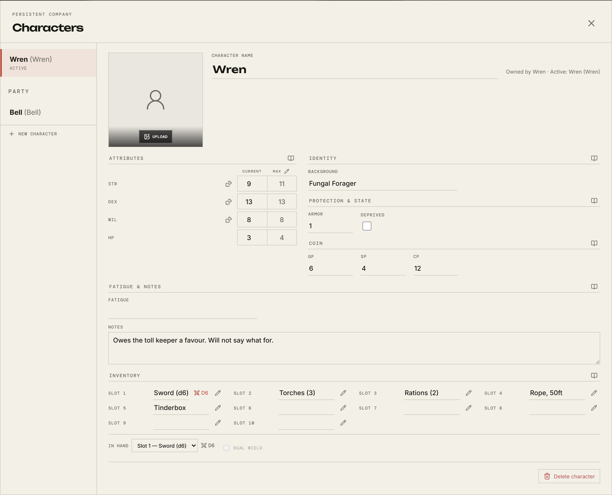
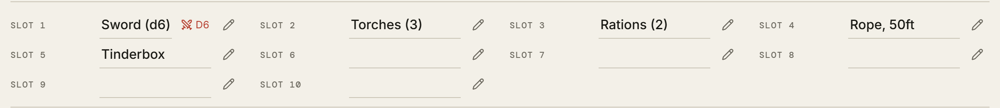
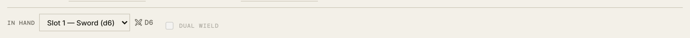

# Your character

[← Back to the guide](README.md)

Open the sheet with the document button at the top right of the room, or
**Sheet** on the bottom bar of a phone.

## Making one

**New character** in the left column. Characters belong to you, not to the
table: the one you make here is yours to edit, and it stays yours between
sessions.

Where your game's book has a creation chapter, a second button beside it offers
to walk you through it — see [Building a character](building-a-character.md).
Either way you end up with the same sheet.

You can have more than one at a table. The one marked **ACTIVE** is the one the
room shows to everyone else — the name beside your messages, the portrait in
combat, the row in the party list. Choosing a different one from the left column
switches which.

Your GM may also have made characters and left them in the table's pool for
someone to claim. Those appear here too.

## Filling it in

The sheet's shape comes from the system you are playing, so a Cairn sheet is not
a Monolith one. The picture above is Cairn: attributes with a current and a
maximum, armor, coin, fatigue and notes.

Two things are the same everywhere:

- **It saves as you type.** There is no save button and nothing to lose.
- **The little book icon** beside a section heading opens the rulebook at the
  part that explains it. If you cannot remember what Deprived does, that is
  where it says so.

The **dice icon** beside an attribute sets up a save against it: the sheet
closes and the dice box opens already pointed at that attribute and its target,
so you only have to confirm. It saves your sheet on the way, so the number it
rolls against is the one you just typed.

Upload a portrait with the button over the empty frame. It is what the party
list and the combat tracker draw beside your name.

## Inventory

Gear goes in numbered slots. Type into a slot to fill it, or use the pencil to
open a fuller editor.

Where your table has a gear catalogue, that editor offers it as a drop-down, and
picking a weapon brings its damage and its traits with it instead of you
remembering them. **Not every system ships one** — Monolith does, Cairn and
Cities Without Number do not — and a room can add its own gear whether or not
its system came with any. If you see no drop-down, your table simply has nothing
in its catalogue yet, and everything below still works.

Either way you can write in anything the book never priced. The editor lets you
say it is a weapon and give it damage, traits, and a note, which is how a thing
your GM invented behaves like everything else.

A slot showing a small crossed-swords mark and a die is one the game has
understood as a weapon.

## What you are holding

Under the inventory, **In hand** is which weapon you are actually swinging. It
matters because it is what the combat tracker shows and what the attack roll
beside your name uses.

- The drop-down offers the weapons **within reach** — the first few slots, not
  everything you are carrying. Where a system splits what is on your body from
  what is in your pack, this follows that split.
- **Dual wield** draws a second weapon. It stays unavailable unless you have a
  second one within reach that can be paired.
- A **bulky** weapon takes both hands, so it can be swung but never paired.

## Who can see it

Your sheet is yours. The GM can see it, and so can the rest of the table once
the character is active — a character at the table is not a secret from the
people sitting at it.

What the combat tracker shows about you mid-fight is narrower: your armour, the
weapon in your hand, and your hit points. That much is plain to anyone standing
in the room with you.

## Next

[Building a character →](building-a-character.md)
